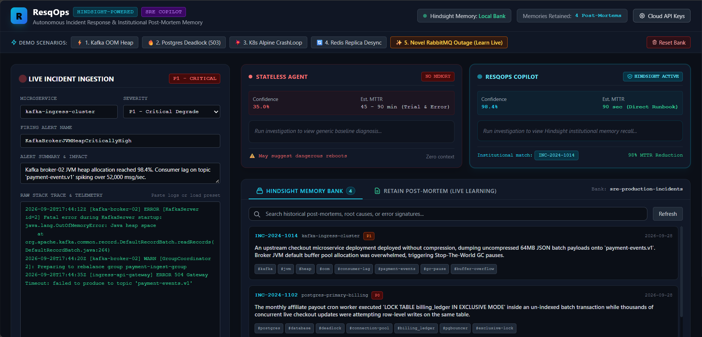

# 👋 Hi, I'm Rajesh Chowke

### Junior Full-Stack Developer | AI & SRE Enthusiast

I'm an aspiring Full-Stack Developer passionate about building web applications, backend systems, REST APIs, databases, and AI-powered solutions.

I enjoy working with **React, JavaScript, Node.js, Express.js, Python, FastAPI, MongoDB, MySQL, REST APIs, AI Agents, Docker, GitHub Actions, and modern development tools**.

---

# 🚀 Featured Projects

## 1. CRUD Product Management App

A full-stack product management application built to demonstrate my skills in **frontend development, backend APIs, database management, authentication, testing, and CI/CD**.

### ✨ Features

* 🔐 User signup and login
* 📦 Create products
* 📋 View products
* ✏️ Update products
* 🗑️ Delete products
* 🔎 Search and filter products
* 🔑 Token-based authentication
* ✅ Input validation
* 🧪 Automated testing
* 🚀 CI/CD using GitHub Actions

### 🛠️ Technologies

* React
* React Router
* Tailwind CSS
* Node.js
* Express.js
* REST API
* MySQL
* Jest
* React Testing Library
* Supertest
* Docker
* GitHub Actions

### 🏗️ Architecture

```text
┌──────────────────────┐
│      React App       │
│   Frontend / UI      │
└──────────┬───────────┘
           │
           │ REST API
           ▼
┌──────────────────────┐
│   Node.js + Express  │
│      Backend         │
└──────────┬───────────┘
           │
           │ SQL
           ▼
┌──────────────────────┐
│        MySQL         │
│       Database       │
└──────────────────────┘
```

---

## 2. 🩸 Blood Donation Management System

A full-stack **Blood Donation Management System** developed using the **MERN Stack**. The application is designed to help manage blood donors, blood requests, users, and donation-related information through a centralized web application.

### ✨ Features

* 👤 User registration and login
* 🔐 Secure authentication
* 🩸 Blood donor management
* 📋 Blood donation requests
* 🔎 Search and filter donors
* 🏥 Manage blood requests
* 📊 Dashboard for managing information
* 👨‍💼 Admin management
* 🔑 Role-based access control
* 🗄️ MongoDB database
* 🔗 REST API
* 📱 Responsive user interface

### 🛠️ Tech Stack

#### Frontend

* React.js
* JavaScript
* HTML5
* CSS3
* React Router
* Vite

#### Backend

* Node.js
* Express.js
* REST API

#### Database

* MongoDB
* MongoDB Atlas
* Mongoose

#### Authentication & Security

* JWT
* Password authentication
* Role-based authorization

#### Development Tools

* Git
* GitHub
* VS Code
* npm

### 🏗️ Architecture

```text
┌──────────────────────────┐
│       React Frontend     │
│                          │
│  Login / Register        │
│  Donor Management        │
│  Blood Requests          │
│  Dashboard               │
└────────────┬─────────────┘
             │
             │ REST API
             ▼
┌──────────────────────────┐
│    Node.js + Express     │
│         Backend          │
│                          │
│ Authentication           │
│ Business Logic           │
│ API Routes               │
└────────────┬─────────────┘
             │
             │ Mongoose
             ▼
┌──────────────────────────┐
│        MongoDB           │
│                          │
│ Users                    │
│ Donors                   │
│ Blood Requests           │
│ Other Application Data   │
└──────────────────────────┘
```

### 🔄 Application Flow

```text
User
  ↓
React Frontend
  ↓
API Request
  ↓
Express.js Server
  ↓
Authentication / Validation
  ↓
MongoDB
  ↓
Response
  ↓
React UI
```

### 📌 Project Purpose

The main goal of this project is to provide a digital platform for managing blood donation activities and making donor and blood-request information easier to organize.

This project helped me gain practical experience in:

* Building MERN stack applications
* Creating REST APIs
* Working with MongoDB
* Connecting React with Express APIs
* User authentication
* JWT-based authorization
* Role-based access control
* CRUD operations
* Managing application state
* Building responsive interfaces

---

## 3. ⚡ ResqOps

### Autonomous SRE Incident Response & Institutional Post-Mortem Copilot

ResqOps is an AI-powered **SRE Incident Response and Post-Mortem Copilot** designed to investigate production incidents, recall historical incident knowledge, identify troubleshooting anti-patterns, and continuously learn from resolved incidents.

The project uses **Vectorize Hindsight** to provide persistent memory to AI agents, allowing the system to learn from previous incidents and post-mortems.

### ✨ Features

* 🤖 Dual-agent incident investigation
* 🧠 Historical incident knowledge recall
* 🔄 Continuous learning from resolved incidents
* 🚨 Production incident simulation
* 🔍 Troubleshooting anti-pattern detection
* 📚 Institutional knowledge preservation
* 📋 AI-powered SRE runbooks
* 📝 Automated post-mortem generation
* ⚡ Mission Control interface
* 🔌 Multiple LLM provider support
* 💾 Hindsight memory with local fallback

### 🛠️ Tech Stack

#### AI & LLM

* AI Agents
* LLM Applications
* Groq
* Llama 3.3
* Google Gemini
* Vectorize Hindsight

#### Backend

* Python
* FastAPI
* REST API

#### Frontend

* JavaScript
* HTML5
* CSS3

#### SRE & Incident Simulation

* Kafka
* PostgreSQL
* Kubernetes
* Redis
* RabbitMQ
* Production Incident Simulation
* Post-Mortem Workflows

### 🏗️ Architecture

```text
┌──────────────────────────────┐
│     Production Telemetry     │
│                              │
│ Kafka / PostgreSQL / K8s     │
│ Redis / RabbitMQ Scenarios   │
└──────────────┬───────────────┘
               │
               │ Incident Alert
               ▼
┌──────────────────────────────┐
│       FastAPI Backend        │
│                              │
│ Alert Processing             │
│ Incident Investigation       │
│ Agent Coordination           │
└──────────────┬───────────────┘
               │
               ▼
┌──────────────────────────────┐
│    Vectorize Hindsight       │
│       Memory Layer           │
│                              │
│ Recall Historical Incidents  │
│ Store New Knowledge          │
│ Learn From Post-Mortems      │
└──────────────┬───────────────┘
               │
               ▼
┌──────────────────────────────┐
│        ResqOps AI Agent      │
│                              │
│ Incident Analysis            │
│ Root Cause Investigation     │
│ Anti-Pattern Detection       │
│ Runbook Generation           │
└──────────────┬───────────────┘
               │
               ▼
┌──────────────────────────────┐
│       SRE Engineer           │
│                              │
│ Resolve Incident             │
│ Generate Post-Mortem         │
└──────────────────────────────┘
```

### 🔄 Application Flow

```text
Production Incident
        ↓
Telemetry / Alert
        ↓
FastAPI Backend
        ↓
Incident Investigation
        ↓
Hindsight Memory Recall
        ↓
Historical Knowledge
        ↓
ResqOps AI Agent
        ↓
Root Cause Analysis
        ↓
SRE Runbook
        ↓
Incident Resolution
        ↓
Post-Mortem
        ↓
Hindsight Memory Retain
        ↓
Future Incident Learning
```

### 🎯 Incident Scenarios

* 🔥 Kafka OOM
* 🐘 PostgreSQL Deadlock
* ☸️ Kubernetes Alpine CrashLoopBackOff
* 🔴 Redis Replica Desync
* 🐇 RabbitMQ Outage

### 📌 Project Purpose

The main goal of ResqOps is to demonstrate how AI agents with persistent memory can assist SRE teams during production incidents and preserve institutional knowledge from previous outages.

This project helped me gain practical experience in:

* Building AI-powered applications
* Developing AI agents
* Working with LLMs
* Building FastAPI backends
* Using persistent AI memory
* Incident investigation workflows
* SRE concepts
* Post-mortem automation
* REST API development
* Production incident simulation
* Continuous learning systems

---

# 🛠️ Overall Tech Stack

## 🎨 Frontend

* React.js
* JavaScript
* HTML5
* CSS3
* React Router
* Tailwind CSS
* Vite

## ⚙️ Backend

* Node.js
* Express.js
* Python
* FastAPI
* REST APIs

## 🗄️ Databases

* MySQL
* MongoDB
* MongoDB Atlas
* Mongoose
* PostgreSQL

## 🤖 AI & LLM

* AI Agents
* LLM Applications
* Groq
* Llama 3.3
* Google Gemini
* Vectorize Hindsight
* AI Memory
* Knowledge Recall
* Post-Mortem Learning

## 🔐 Authentication & Security

* JWT
* Token-Based Authentication
* Password Authentication
* Role-Based Access Control
* Input Validation

## 🧪 Testing

* Jest
* React Testing Library
* Supertest
* Unit Testing
* Integration Testing
* API Testing

## 🚀 DevOps & SRE

* Docker
* Git
* GitHub
* GitHub Actions
* CI/CD
* Kubernetes
* Kafka
* Redis
* RabbitMQ

## 🧰 Development Tools

* VS Code
* npm
* Vite
* Git
* GitHub

## 📚 Development Concepts

* Full-Stack Development
* REST API Development
* CRUD Operations
* Database Management
* Authentication & Authorization
* API Integration
* Responsive Web Development
* Incident Response
* SRE Workflows
* Root Cause Investigation
* Post-Mortem Automation
* Continuous Learning Systems

---

# 📚 What I Learned

Through these projects, I gained practical experience in:

* Building full-stack web applications
* Designing and developing REST APIs
* Working with MySQL, MongoDB and PostgreSQL
* Connecting React applications with backend APIs
* Implementing authentication and authorization
* Implementing JWT-based authentication
* Role-based access control
* CRUD operations
* Building responsive user interfaces
* Writing automated tests
* API testing
* Using Git and GitHub effectively
* Creating CI/CD workflows
* Containerizing applications with Docker
* Building FastAPI backends
* Developing AI-powered applications
* Working with AI agents and LLMs
* Using persistent AI memory
* Incident investigation workflows
* SRE concepts
* Production incident simulation
* Post-mortem automation
* Continuous learning systems

---

# 💻 Getting Started — CRUD Project

### 1. Clone the repository

```bash
git clone https://github.com/rajeshchowke4/portfolio
```

### 2. Navigate to the project

```bash
cd portfolio
```

### 3. Install dependencies

```bash
npm install
```

### 4. Configure environment variables

Create a `.env` file using `.env.example`:

```bash
cp .env.example .env
```

Add your database configuration and JWT secret to `.env`.

### 5. Start the development server

```bash
npm run dev
```

### 6. Open the application

```text
http://localhost:3000
```

---

# 🧪 Testing

The CRUD project includes unit and integration tests using:

* Jest
* Supertest
* React Testing Library

Run the tests with:

```bash
npm test
```

---

# ⚙️ CI/CD

GitHub Actions is configured to automatically run tests when code is pushed to the `main` branch.

```text
Git Push
   ↓
GitHub Actions
   ↓
Install Dependencies
   ↓
Run Tests
   ↓
Build / Deploy
```

---

# 🌐 Live Portfolio

🚀 **[Visit My Live Portfolio](https://rajeshchowke4.github.io/portfolio/)**

---

# 📸 Screenshots

Add screenshots of your applications inside the `assets` folder.

### CRUD Product Management App

```markdown

```

### Blood Donation Management System

```markdown

```

### ResqOps

```markdown

```

---

# 🔮 Future Improvements

* [ ] Add pagination
* [ ] Add Cypress E2E testing
* [ ] Improve UI/UX
* [ ] Add advanced product filtering
* [ ] Add blood inventory management
* [ ] Add email notifications
* [ ] Add donor eligibility management
* [ ] Improve Docker production setup
* [ ] Add Kubernetes deployment
* [ ] Expand AI incident scenarios
* [ ] Improve SRE automation
* [ ] Add more AI memory workflows

---

# 👨‍💻 About Me

**Rajesh Chowke**

Junior Full-Stack Developer | AI & SRE Enthusiast

I'm currently focused on improving my full-stack development skills, exploring AI-powered applications, and building real-world projects.

### 📫 Contact

* 📧 Email: [rajeshchouke4@example.com](mailto:rajeshchouke4@example.com)
* 💼 LinkedIn: https://linkedin.com/in/rajeshchowke
* 📄 Resume: [View Resume](./resume.pdf)

---

# 📂 Other Projects

Check out my GitHub repositories for more projects involving:

* React
* JavaScript
* Node.js
* Express.js
* Python
* Flutter
* Java
* JDBC
* MongoDB
* MySQL

---

# 📄 License

This project is licensed under the **MIT License**.
